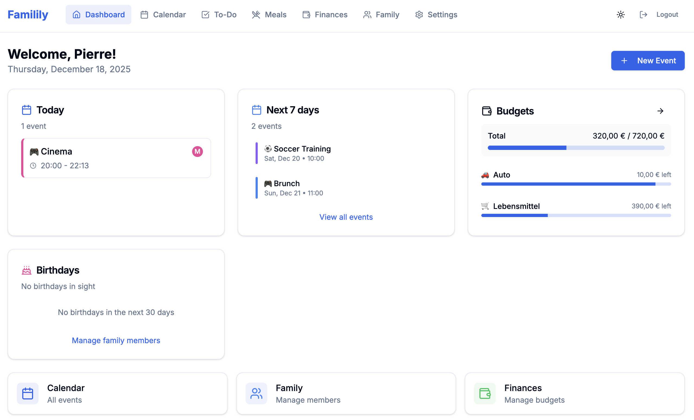
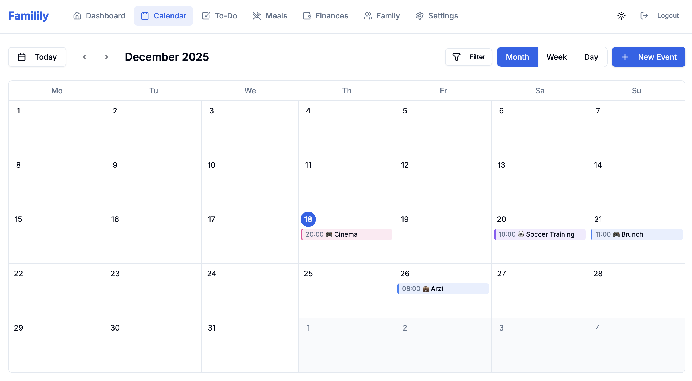
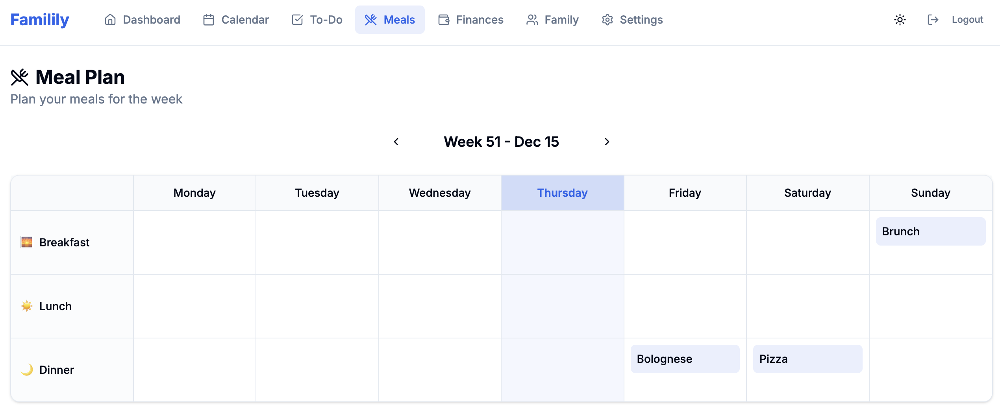
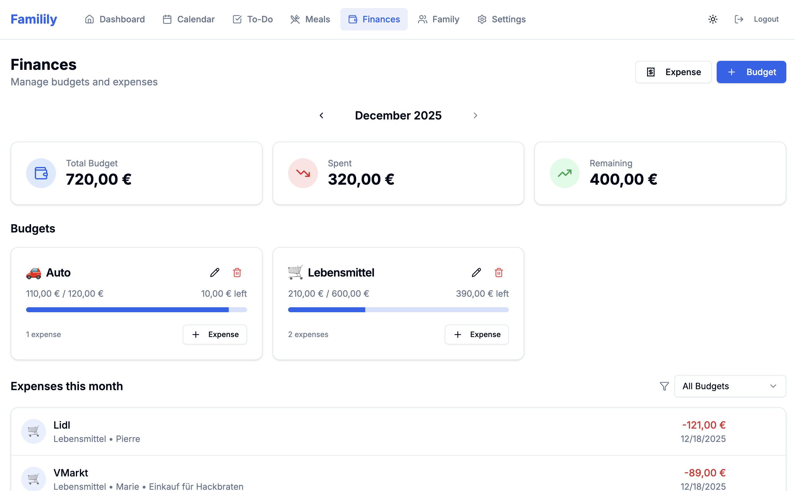

# Familily

**Open Source Self-Hosted Family Calendar & Organizer**

A privacy-first family organization app for shared calendars, to-do lists, and budget tracking. Self-hosted, no cloud dependencies, designed for families who value their data privacy.

---

## Screenshots

### Dashboard


### Calendar


### Meal Planning


### Finances


---

## Features

### Calendar
- **Multiple Views**: Month, week, and day views with intuitive navigation
- **Event Management**: Create, edit, and delete events with rich details
- **Recurring Events**: Daily, weekly, monthly, and yearly repetition patterns
- **Categories**: Doctor, School, Sport, Work, Leisure, Birthday, Holiday, Other
- **Conflict Detection**: Warnings when scheduling overlapping appointments
- **Participant Assignment**: Assign family members to events with color coding
- **iCal Export**: Generate shareable calendar feeds for external calendar apps

### To-Do Lists
- **Shared Lists**: Collaborative to-do lists for the whole family
- **Priority Levels**: Low, Normal, High priority for task organization
- **Assignments**: Assign tasks to specific family members
- **Due Dates**: Set deadlines and track completion
- **Progress Tracking**: Visual completion indicators

### Budget Tracking
- **Monthly Budgets**: Create budgets with customizable reset days
- **Expense Logging**: Track spending with vendor and description
- **Visual Progress**: Progress bars showing budget utilization
- **Dashboard Widget**: Quick budget overview on the main dashboard
- **Historical View**: Browse expenses by month

### Meal Planning
- **Weekly View**: Plan meals for the entire week (Monday-Sunday)
- **Three Meals Per Day**: Breakfast, lunch, and dinner slots
- **Recipe Links**: Save URLs to your favorite recipes
- **Today Highlight**: Current day is visually highlighted
- **Easy Navigation**: Switch between weeks with simple controls

### Family Management
- **Member Profiles**: Name, birthdate, color, and optional login credentials
- **Role System**: Admin, Adult, Child, and Member roles
- **Color Coding**: Each member has a unique color for easy identification

### Additional Features
- **Multi-Language**: Full German and English support with easy switching
- **Dark Mode**: System-aware or manual dark/light theme toggle
- **PWA Ready**: Installable on mobile devices
- **Push Notifications**: Event reminders via Pushover integration
- **Responsive Design**: Works on desktop, tablet, and mobile

---

## Tech Stack

| Component | Technology |
|-----------|------------|
| Framework | Next.js 14 (App Router) |
| Language | TypeScript (strict mode) |
| Database | SQLite + Prisma ORM |
| Styling | Tailwind CSS |
| UI Components | shadcn/ui |
| Authentication | NextAuth.js (Credentials) |
| Forms | React Hook Form + Zod |
| Icons | Lucide Icons |
| Date Handling | date-fns |

---

## Quick Start

### Prerequisites

- Node.js 18+
- npm or yarn

### Installation

```bash
# Clone the repository
git clone https://github.com/PierrePetite/familily.git
cd familily

# Install dependencies
npm install

# Set up environment variables
cp .env.example .env.local
# Edit .env.local with your settings

# Initialize the database
npx prisma generate
npx prisma db push

# Start development server
npm run dev
```

Open [http://localhost:3000](http://localhost:3000) and follow the setup wizard.

### Environment Variables

Create a `.env.local` file:

```env
# Database
DATABASE_URL="file:./data/familily.db"

# NextAuth (generate a secure random string)
NEXTAUTH_SECRET="your-secret-key-here"
NEXTAUTH_URL="http://localhost:3000"

# Optional: Pushover Notifications
PUSHOVER_APP_TOKEN="your-pushover-app-token"
```

---

## Production Deployment

### Proxmox LXC (One-Line Install)

The easiest way to deploy on Proxmox. Run this **on your Proxmox host**:

```bash
bash -c "$(curl -fsSL https://raw.githubusercontent.com/PierrePetite/familily/main/scripts/create-lxc.sh)"
```

This will:
- Create a Debian 12 LXC container
- Install Node.js and all dependencies
- Build and configure Familily
- Set up auto-start on boot

**Or install inside an existing LXC/VM:**

```bash
bash -c "$(curl -fsSL https://raw.githubusercontent.com/PierrePetite/familily/main/scripts/install-lxc.sh)"
```

### Docker

```bash
# Clone and start with Docker Compose
git clone https://github.com/PierrePetite/familily.git
cd familily
docker compose up -d
```

Or build manually:

```bash
# Build the image
docker build -t familily .

# Run with persistent data
docker run -d \
  -p 3000:3000 \
  -v familily-data:/app/data \
  -e NEXTAUTH_SECRET="$(openssl rand -base64 32)" \
  -e NEXTAUTH_URL="http://localhost:3000" \
  familily
```

### Manual Deployment

```bash
# Clone repository
git clone https://github.com/PierrePetite/familily.git
cd familily

# Install dependencies
npm ci

# Setup environment
cp .env.example .env.local
# Edit .env.local with your settings

# Build and initialize
npx prisma generate
npx prisma db push
npm run build

# Start production server
npm start
```

---

## First-Time Setup

1. Open the app in your browser
2. The setup wizard will guide you through:
   - Creating the admin account (name, email, password)
   - Setting up your family name
   - Adding initial family members
3. After setup, log in with your admin credentials
4. Start adding events, to-dos, and budgets!

---

## Project Structure

```
familily/
├── src/
│   ├── app/                    # Next.js App Router
│   │   ├── (auth)/            # Protected routes
│   │   │   ├── dashboard/     # Main dashboard
│   │   │   ├── calendar/      # Calendar views
│   │   │   ├── todos/         # To-do lists
│   │   │   ├── finances/      # Budget tracking
│   │   │   ├── family/        # Member management
│   │   │   └── settings/      # App settings
│   │   ├── (public)/          # Public routes
│   │   │   ├── login/         # Login page
│   │   │   └── setup/         # Setup wizard
│   │   └── api/               # API routes
│   │
│   ├── components/
│   │   ├── ui/                # shadcn/ui components
│   │   ├── calendar/          # Calendar components
│   │   ├── todos/             # To-do components
│   │   ├── finance/           # Budget components
│   │   ├── meals/             # Meal planning components
│   │   ├── family/            # Family components
│   │   └── layout/            # Layout components
│   │
│   ├── lib/
│   │   ├── i18n/              # Internationalization
│   │   ├── validations/       # Zod schemas
│   │   ├── prisma.ts          # Database client
│   │   └── auth.ts            # Auth configuration
│   │
│   └── types/                 # TypeScript types
│
├── prisma/
│   └── schema.prisma          # Database schema
│
└── public/                    # Static assets
```

---

## Available Scripts

```bash
# Development
npm run dev          # Start dev server
npm run build        # Production build
npm run start        # Start production server
npm run lint         # Run ESLint

# Database
npx prisma generate  # Generate Prisma client
npx prisma db push   # Push schema to database
npx prisma studio    # Open database GUI
npx prisma migrate   # Run migrations
```

---

## Language Support

Familily supports German and English. Switch languages in Settings.

| Feature | German | English |
|---------|--------|---------|
| Interface | Complete | Complete |
| Date Formats | DD.MM.YYYY | MM/DD/YYYY |
| Calendar | Weeks start Monday | Weeks start Monday |

---

## Privacy & Security

- **Self-Hosted**: Your data stays on your server
- **No Analytics**: No tracking, no telemetry
- **Local Database**: SQLite file stored locally
- **Password Hashing**: bcrypt for secure password storage
- **Session-Based Auth**: Secure JWT tokens via NextAuth.js

---

## Contributing

Contributions are welcome! Please feel free to submit a Pull Request.

1. Fork the repository
2. Create your feature branch (`git checkout -b feature/AmazingFeature`)
3. Commit your changes (`git commit -m 'Add some AmazingFeature'`)
4. Push to the branch (`git push origin feature/AmazingFeature`)
5. Open a Pull Request

---

## Roadmap

- [ ] CalDAV server integration
- [x] Meal planning module
- [ ] Document storage
- [ ] Email notifications (SMTP)
- [ ] Mobile app (React Native)
- [ ] Multi-family support

---

## License

MIT License - see [LICENSE](LICENSE) for details.

Free to use, modify, and distribute.

---

## Support

- **Issues**: [GitHub Issues](https://github.com/PierrePetite/familily/issues)
- **Discussions**: [GitHub Discussions](https://github.com/PierrePetite/familily/discussions)

---

Made with love for families who care about privacy.
